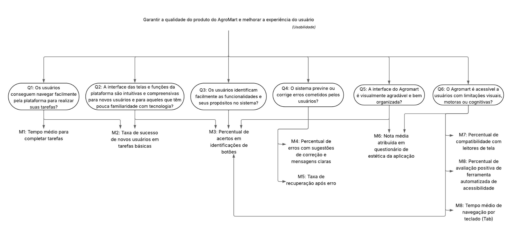
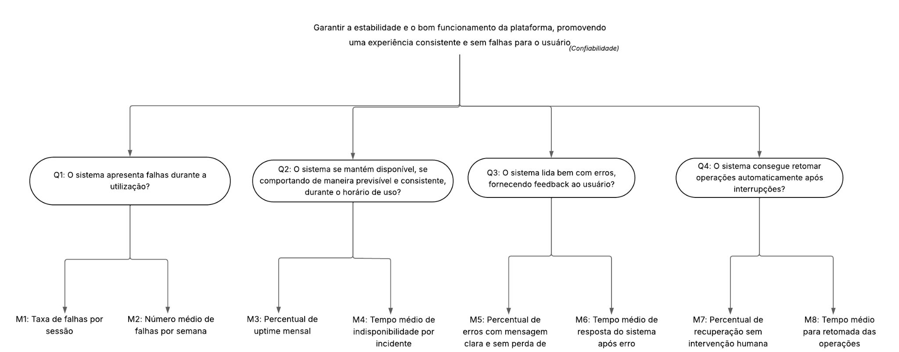

## Objetivo de Negócio do AgroMart

O objetivo de negócio do AGROMART é desenvolver um software inovador que estabeleça uma conexão direta entre agricultores e consumidores, especialmente em resposta aos desafios impostos pelo isolamento social durante a pandemia da COVID-19. A plataforma tem como foco principal facilitar e fortalecer a comercialização de produtos agroecológicos, promovendo o acesso direto ao mercado para pequenos produtores rurais.

O AGROMART funciona como uma ferramenta digital de apoio à criação e à gestão de Comunidades que Sustentam a Agricultura (CSAs), permitindo que os produtores organizem entregas, compartilhem informações sobre os produtos e se comuniquem diretamente com os consumidores e com as comunidades envolvidas. Além disso, a plataforma visa melhorar a gestão e o engajamento entre agricultores e administradores das CSAs, por meio de um sistema acessível, estável e adaptado às necessidades específicas de ambos os perfis.

O projeto busca enfrentar desafios recorrentes no meio rural, como a dificuldade de inserção no mercado formal e a dependência de intermediários, que muitas vezes reduzem a margem de lucro do produtor. Para isso, o AGROMART oferece funcionalidades como cadastro de usuários, listagem e pedido de produtos, gestão de entregas e apoio à formação de grupos de consumo consciente.

## Objetivo de Medição 1: Usabilidade

|||
|---|---|
| Analisar | o AgroMart |
| Para o propósito de | entender  a qualidade do produto da plataforma para melhorar a experiência do usuário|
| Com respeito a | usabilidade |
| Do ponto de vista da | equipe de desenvolvimento |
| No contexto da | disciplina |

## Objetivo de Medição 2: Confiabilidade

|||
|---|---|
| Analisar | o AgroMart |
| Para o propósito de | Entender  a estabilidade e o bom funcionamento da plataforma, promovendo uma experiência consistente e sem falhas para o usuário |
| Com respeito a | confiabilidade |
| Do ponto de vista da | equipe de desenvolvimento |
| No contexto da | disciplina |

## Questões Objetivo de Medição 1: Usabilidade

> **Q1:** Os usuários conseguem navegar facilmente pela plataforma para realizar suas tarefas?  
**Hipótese 1:** A maioria dos usuários consegue completar suas tarefas sem dificuldades significativas.

> **Q2:** A interface das telas e funções da plataforma são intuitivas e compreensivas para novos usuários?  
**Hipótese 2:** Novos usuários e usuários com baixa familiaridade com a tecnologia, conseguem entender e utilizar a plataforma com mínima orientação.

> **Q3:** Os usuários identificam facilmente as funcionalidades e seus propósitos no sistema?  
**Hipótese 3:** Mais de 85% dos usuários compreendem os ícones e botões sem a necessidade de ajuda externa ou tutorial.

> **Q4:** O sistema previne ou corrige erros cometidos pelos usuários?  
**Hipótese 4:** O Agromart oferece mensagens claras e opções de correção em mais de 90% dos erros detectados.

> **Q5:** A interface do Agromart é visualmente agradável e bem organizada?  
**Hipótese 5:** Mais de 90% dos usuários avaliam a estética como organizadas, cores agradáveis e hierarquia visual.

> **Q6:** O Agromart é acessível a usuários com limitações visuais, motoras ou cognitivas?  
**Hipótese 6:** O sistema é compatível com leitores de tela e possui contraste adequado em mais de 95% das telas avaliadas.

## Questões Objetivo de Medição 2: Confiabilidade

> **Q1:** O sistema apresenta falhas durante a utilização?  
**Hipótese 1:** As falhas são raras e afetam menos de 5% das sessões.

> **Q2:** O sistema se mantém disponível, se comportando de maneira previsível e consistente, durante o horário de uso?  
**Hipótese 2:** O tempo de disponibilidade é superior a 99% no mês.

> **Q3:** O sistema lida bem com erros, fornecendo feedback ao usuário?  
**Hipótese 3:** Em 90% dos erros, há mensagens claras e sem perda de dados.

> **Q4:** O sistema consegue retomar operações automaticamente após interrupções?  
**Hipótese 4:** O sistema retoma suas operações em mais de 95% dos casos de interrupções, sem necessidade de ajuda externa.

## Relação entre Objetivos de Medição - Questões e Métricas - Objetivo de Medição 1: Usabilidade

<!--

<iframe allowfullscreen frameborder="0" style="width:640px; height:480px" src="https://lucid.app/documents/embedded/528adcf3-936a-4628-815a-332c93e97a77" id="xzNge43~wSc2"></iframe>

-->

Link de acesso: https://lucid.app/lucidchart/528adcf3-936a-4628-815a-332c93e97a77/edit?viewport_loc=-11%2C-11%2C2229%2C1059%2C0_0&invitationId=inv_4e843cec-3c75-4263-9ebe-4ac75a531938

## Relação entre Objetivos de Medição - Questões e Métricas - Objetivo de Medição 2: Confiabilidade

<!--

<iframe allowfullscreen frameborder="0" style="width:640px; height:480px" src="https://lucid.app/documents/embedded/204674cd-d3bd-4ca0-b8c3-4cf8daec7142" id="GENgbFXe6QNI"></iframe>

-->

Link de acesso: https://lucid.app/lucidchart/204674cd-d3bd-4ca0-b8c3-4cf8daec7142/edit?viewport_loc=-11%2C-11%2C2229%2C1059%2C0_0&invitationId=inv_a379581b-d50b-404b-b579-973f49dc900

## Abstraction Sheets - Objetivo de Medição 1: Usabilidade

<table>
  <tr>
    <th>Object</th>
    <th>Purpose</th>
    <th>Quality Focus</th>
    <th>Viewpoint</th>
  </tr>
  <tr>
    <td>Plataforma Agromart</td>
    <td>Compreender a facilidade de uso e interação do usuário com o sistema.</td>
    <td>Usabilidade e suas subcaracterísticas: adequação, reconhecibilidade, aprendizado, proteção contra erros, estética e acessibilidade.</td>
    <td>Equipe de desenvolvimento e usuários finais (agricultores e consumidores)</td>
  </tr>
  <tr>
    <th colspan="2">Quality Focus</th>
    <th colspan="2">Variation Factors</th>
  </tr>
  <tr>
    <td colspan="2">
        <ul>
            <li>Facilidade de navegação</li>
            <li>Reconhecimento de funcionalidades</li>
            <li>Clareza das informações exibidas</li>
            <li>Ocorrência de erros</li>
            <li>Tempo médio para realizar tarefas básicas (ex: cadastro, pedido, login)</li>
            <li>Grau de autonomia do usuário (sem necessidade de ajuda externa)</li>
            <li>Nível de acessibilidade</li>
        </ul>
    </td>
    <td colspan="2">
        <ul>
            <li>Familiaridade prévia dos usuários com tecnologia</li>
            <li>Qualidade visual e responsividade da interface</li>
            <li>Nível de clareza textual das instruções e tutoriais (labels, mensagens, botões)</li>
            <li>Dispositivos utilizados (PC, celular, tablet)</li>
        </ul>
    </td>
  </tr>
    <tr>
    <th colspan="2">Baseline Hypotheses (estimates)</th>
    <th colspan="2">Impact of Variation Factors</th>
  </tr>
  <tr>
    <td colspan="2">
        <ul>
            <li>80% dos usuários concluem tarefas sem dificuldades</li>
            <li>Novos usuários compreendem a plataforma com até 5 minutos de uso exploratório</li>
            <li>Tempo médio para finalizar uma compra: até 3 minutos</li>
            <li>Pelo menos 85% dos usuários reconhecem as funcionalidades básicas sem ajuda externa</li>
            <li>95% acessam com leitores de tela e bom contraste</li>
        </ul>
    </td>
    <td colspan="2">
        <ul>
            <li>Usuários com baixa familiaridade digital demandam mais clareza e feedback</li>
            <li>Melhor escrita e organização visual aumentam a autonomia dos usuários</li>
            <li>O uso de dispositivos móveis pode afetar negativamente a experiência se o layout não for adaptado</li>
            <li>Usuários menos familiarizados têm mais dificuldade se a interface não for intuitiva</li>
            <li>Melhorias no design e tutoriais reduzem o número de falhas de uso</li>
        </ul>
    </td>
  </tr>
</table>

## Abstraction Sheets - Objetivo de Medição 2: Confiabilidade

<table>
  <tr>
    <th>Object</th>
    <th>Purpose</th>
    <th>Quality Focus</th>
    <th>Viewpoint</th>
  </tr>
  <tr>
    <td>Plataforma Agromart</td>
    <td>Compreender a estabilidade e a capacidade de recuperação do sistema</td>
    <td>Confiabilidade e suas subcaracterísticas: maturidade, disponibilidade, tolerância a falhas, recuperabilidade.</td>
    <td>Equipe de desenvolvimento e manutenção do sistema</td>
  </tr>
  <tr>
    <th colspan="2">Quality Focus</th>
    <th colspan="2">Variation Factors</th>
  </tr>
  <tr>
    <td colspan="2">
        <ol>
            <li>Número de falhas:</li>
            <ul>
                <li>Durante uso normal pelos usuários</li>
                <li>Por tipo de falha (erro de sistema, indisponibilidade, falhas de feedback)</li>
                <li>Por frequência de ocorrência</li>
                <li>Por impacto no processo de comercialização</li>
            </ul>
            <li>Tempo médio de disponibilidade</li>
            <li>Respostas aos erros</li>
            <li>Capacidade de retomada após interrupções</li>
        </ol>
    </td>
    <td colspan="2">
        <ul>
            <li>Volume de usuários simultâneos</li>
            <li>Infraestrutura da aplicação</li>
            <li>Nível de conectividade da rede dos usuários</li>
            <li>Qualidade do código e cobertura de testes</li>
            <li>Frequência de deploys e atualizações</li>
        </ul>
    </td>
  </tr>
    <tr>
    <th colspan="2">Baseline Hypotheses (estimates)</th>
    <th colspan="2">Impact of Variation Factors</th>
  </tr>
  <tr>
    <td colspan="2">
        <ol>
            <li>Distribuição esperada de falhas (durante um mês de uso):</li>
            <ul>
                <li>Leves: 70% (ex: mensagens pouco claras, pequenos travamentos)</li>
                <li>Médias: 20% (ex: erros que exigem recarregar a página)</li>
                <li>Graves: 10% (ex: falha ao finalizar pedidos ou perda de dados)</li>
            </ul>
            <li>Disponibilidade mensal > 99%</li>
            <li>90% dos erros exibem mensagens claras</li>
            <li>95% dos processos retomam automaticamente após falhas</li>
        </ol>
    </td>
    <td colspan="2">
        <ul>
            <li>Alta carga de usuários pode aumentar falhas graves e lentidão</li>
            <li>Cobertura de testes baixa pode causar aumento em falhas médias e graves</li>
            <li>Boa conectividade dos usuários reduz falhas percebidas relacionadas à rede</li>
            <li>Deploys frequentes sem revisão adequada tendem a aumentar falhas inesperadas</li>
            <li>Melhor infraestrutura e monitoramento aumentam a disponibilidade e a recuperabilidade.</li>
        </ul>
    </td>
  </tr>
</table>

## Tabela de Contribuição

| Matrícula | Nome completo | Contribuição (%) |
|:---:|---|:---:|
|221007798|Ana Júlia Mendes Santos|16,66|
|221022355|Júlia Rocha Fortunato|16,66|
|221008338|Maria Clara Oleari de Araujo|16,66|
|222007021|Maurício Ferreira de Araújo|16,66|
|222006356|Pedro Lock Martins|16,66|
|221022767|Weverton Rodrigues da Costa Silva|16,66|