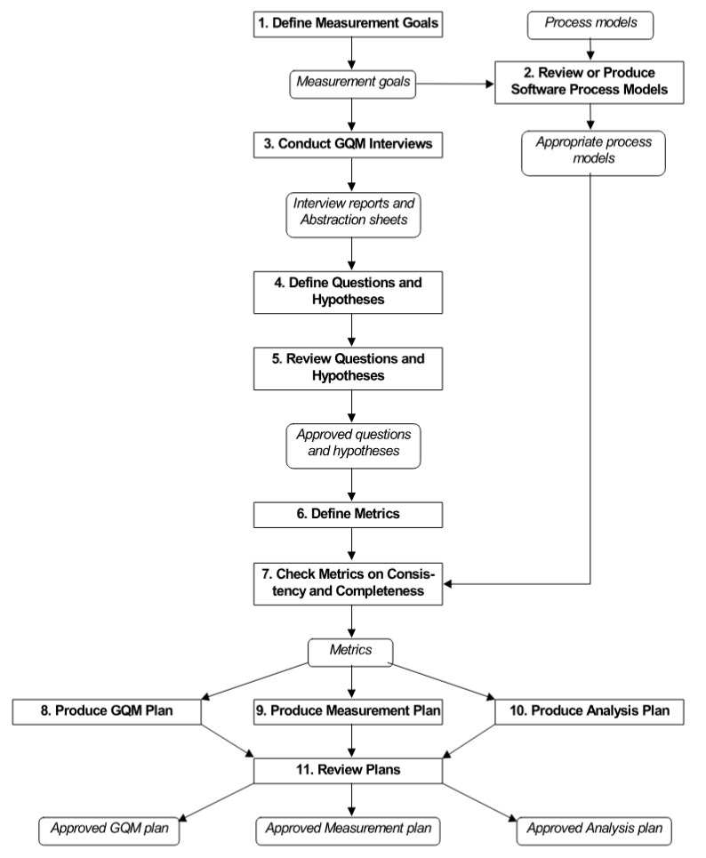

# Aplicação da Metodologia GQM

A equipe seguiu as oito primeiras fases da metodologia GQM (Goal-Question-Metric) para estruturar a avaliação da plataforma AgroMart. 

Inicialmente, foram definidos os objetivos de medição, com foco em usabilidade e confiabilidade. Em seguida, revisou-se o contexto do sistema e realizaram-se discussões em grupo para a elaboração dos abstraction sheets, o que permitiu a definição colaborativa de perguntas e hipóteses alinhadas aos objetivos propostos.

As questões levantadas foram refinadas e vinculadas a métricas específicas, que passaram por revisão quanto à consistência e completude. Por fim, foi elaborado o plano GQM, consolidando todos os elementos definidos.

Figura 1 - Definição de procedimentos GQM

Fonte: Retirado de Basili et al. [1]

## Objetivo de Negócio do AgroMart

O objetivo de negócio do AGROMART é desenvolver um software inovador que estabeleça uma conexão direta entre agricultores e consumidores, especialmente em resposta aos desafios impostos pelo isolamento social durante a pandemia da COVID-19. A plataforma tem como foco principal facilitar e fortalecer a comercialização de produtos agroecológicos, promovendo o acesso direto ao mercado para pequenos produtores rurais.

O AGROMART funciona como uma ferramenta digital de apoio à criação e à gestão de Comunidades que Sustentam a Agricultura (CSAs), permitindo que os produtores organizem entregas, compartilhem informações sobre os produtos e se comuniquem diretamente com os consumidores e com as comunidades envolvidas. Além disso, a plataforma visa melhorar a gestão e o engajamento entre agricultores e administradores das CSAs, por meio de um sistema acessível, estável e adaptado às necessidades específicas de ambos os perfis.

O projeto busca enfrentar desafios recorrentes no meio rural, como a dificuldade de inserção no mercado formal e a dependência de intermediários, que muitas vezes reduzem a margem de lucro do produtor. Para isso, o AGROMART oferece funcionalidades como cadastro de usuários, listagem e pedido de produtos, gestão de entregas e apoio à formação de grupos de consumo consciente.

## Objetivo de Medição 1: Usabilidade

<table border="1">
  <tr>
    <td>Analisar</td>
    <td>o AgroMart</td>
  </tr>
  <tr>
    <td>Para o propósito de</td>
    <td>entender a qualidade do produto da plataforma para melhorar a experiência do usuário</td>
  </tr>
  <tr>
    <td>Com respeito a</td>
    <td>usabilidade</td>
  </tr>
  <tr>
    <td>Do ponto de vista da</td>
    <td>equipe de desenvolvimento</td>
  </tr>
  <tr>
    <td>No contexto da</td>
    <td>disciplina</td>
  </tr>
</table>

## Objetivo de Medição 2: Confiabilidade

<table border="1">
  <tr>
    <td>Analisar</td>
    <td>o AgroMart</td>
  </tr>
  <tr>
    <td>Para o propósito de</td>
    <td>Entender a estabilidade e o bom funcionamento da plataforma, promovendo uma experiência consistente e sem falhas para o usuário</td>
  </tr>
  <tr>
    <td>Com respeito a</td>
    <td>confiabilidade</td>
  </tr>
  <tr>
    <td>Do ponto de vista da</td>
    <td>equipe de desenvolvimento</td>
  </tr>
  <tr>
    <td>No contexto da</td>
    <td>disciplina</td>
  </tr>
</table>

## Questões Objetivo de Medição 1: Usabilidade

> **Q1:** Os usuários conseguem navegar facilmente pela plataforma para realizar suas tarefas?  
**Hipótese 1:** A maioria dos usuários consegue completar suas tarefas sem dificuldades significativas.

> **Q2:** A interface das telas e funções da plataforma são intuitivas e compreensivas para novos usuários?  
**Hipótese 2:** Novos usuários e usuários com baixa familiaridade com a tecnologia, conseguem entender e utilizar a plataforma com mínima orientação.

> **Q3:** Os usuários identificam facilmente as funcionalidades e seus propósitos no sistema?  
**Hipótese 3:** Mais de 85% dos usuários compreendem os ícones e botões sem a necessidade de ajuda externa ou tutorial.

> **Q4:** O sistema previne ou corrige erros cometidos pelos usuários?  
**Hipótese 4:** O Agromart oferece mensagens claras e opções de correção em mais de 90% dos erros detectados.

> **Q5:** A interface do Agromart é visualmente agradável e bem organizada?  
**Hipótese 5:** Mais de 90% dos usuários avaliam a estética como organizadas, cores agradáveis e hierarquia visual.

> **Q6:** O Agromart é acessível a usuários com limitações visuais, motoras ou cognitivas?  
**Hipótese 6:** O sistema é compatível com leitores de tela e possui contraste adequado em mais de 95% das telas avaliadas.

## Questões Objetivo de Medição 2: Confiabilidade

> **Q1:** O sistema apresenta falhas durante a utilização?  
**Hipótese 1:** As falhas são raras e afetam menos de 5% das sessões.

> **Q2:** O sistema se mantém disponível, se comportando de maneira previsível e consistente, durante o horário de uso?  
**Hipótese 2:** O tempo de disponibilidade é superior a 99% no mês.

> **Q3:** O sistema lida bem com erros, fornecendo feedback ao usuário?  
**Hipótese 3:** Em 90% dos erros, há mensagens claras e sem perda de dados.

> **Q4:** O sistema consegue retomar operações automaticamente após interrupções?  
**Hipótese 4:** O sistema retoma suas operações em mais de 95% dos casos de interrupções, sem necessidade de ajuda externa.

## Relação entre Objetivos de Medição - Questões e Métricas - Objetivo de Medição 1: Usabilidade

<!--

<iframe allowfullscreen frameborder="0" style="width:640px; height:480px" src="https://lucid.app/documents/embedded/528adcf3-936a-4628-815a-332c93e97a77" id="xzNge43~wSc2"></iframe>

-->

Figura 2 - Questões e Métricas - Usabilidade

## Relação entre Objetivos de Medição - Questões e Métricas - Objetivo de Medição 2: Confiabilidade

<!--

<iframe allowfullscreen frameborder="0" style="width:640px; height:480px" src="https://lucid.app/documents/embedded/204674cd-d3bd-4ca0-b8c3-4cf8daec7142" id="GENgbFXe6QNI"></iframe>

-->

Figura 3 - Questões e Métricas - Confiabilidade

## Bibliografia
> \- ISO/IEC 25010:2011. Disponível em: https://iso25000.com/index.php/en/iso-25000-standards/iso-25010. Acesso em: 02 de junho de 2025.

> \- WORLD WIDE WEB CONSORTIUM. Web Content Accessibility Guidelines (WCAG) 2.1. Disponível em: https://www.w3.org/TR/WCAG21/. Acesso em: 02 de junho de 2025.

## Referências Bibliográficas

> [1] BASILI, Victor R.; CALDIERA, Gianluigi; ROMBACH, Hans Dieter. The Goal Question Metric (GQM) Approach. In: MARCINIAK, J. J. (ed.). Encyclopedia of Software Engineering. New York: John Wiley & Sons, 1994. cap. 6, p. 50. Ilust. (Figura 6-2).

## Tabela de Contribuição

  <table border="1">
    <thead>
      <tr>
        <th>Matrícula</th>
        <th>Nome completo</th>
        <th>Contribuição (%)</th>
      </tr>
    </thead>
    <tbody>
      <tr>
        <td>221007798</td>
        <td><a href="https://github.com/ailujana">Ana Júlia Mendes Santos</a></td>
        <td>19</td>
      </tr>
      <tr>
        <td>221022355</td>
        <td><a href="https://github.com/julia-fortunato">Júlia Rocha Fortunato</a></td>
        <td>19</td>
      </tr>
      <tr>
        <td>221008338</td>
        <td><a href="https://github.com/Oleari19">Maria Clara Oleari de Araujo</a></td>
        <td>19</td>
      </tr>
      <tr>
        <td>222007021</td>
        <td><a href="https://github.com/mauricio-araujoo">Maurício Ferreira de Araújo</a></td>
        <td>19</td>
      </tr>
      <tr>
        <td>222006356</td>
        <td><a href="https://github.com/PedroLock">Pedro Lock Martins</a></td>
        <td>5</td>
      </tr>
      <tr>
        <td>221022767</td>
        <td><a href="https://github.com/vevetin">Weverton Rodrigues da Costa Silva</a></td>
        <td>19</td>
      </tr>
    </tbody>
  </table>

## Historico de Versões

|Versão|Data|Descrição|Autor|Revisor|
|:----:|----|---------|-----|:-------:|
|`1.0`|22/05/2025|Criação do documento|[Weverton Rodrigues](https://github.com/vevetin)|[Júlia Fortunato](https://github.com/julia-fortunato)|
