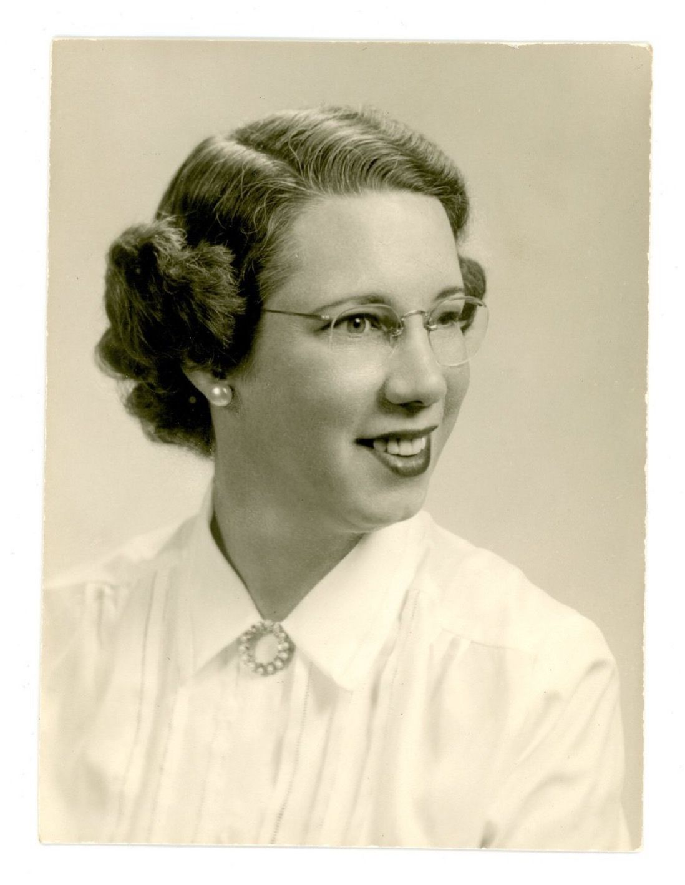

# Grupo Betty Snyder - Turma 1 (2025.1)

## Sobre o Projeto

Esta página é dedicada à documentação de todos os artefatos criados pelo Grupo Betty Snyder no primeiro semestre de 2025, na disciplina de Qualidade de Software da Faculdade de Ciências e Tecnologias em Engenharia da Universidade de Brasília (FCTE-UnB).

Na figura 1 é possível encontrar a foto da mulher a qual nomeia o nosso grupo, Betty Snyder. 

Betty Snyder foi uma das seis primeiras programadoras do ENIAC, o primeiro computador digital eletrônico de uso geral. Durante a Segunda Guerra Mundial, ela fez parte de um grupo pioneiro de mulheres que programavam utilizando apenas painéis e cabos, sem as linguagens que conhecemos nos dias atuais. Além disso, contribuiu para o desenvolvimento de linguagens como COBOL e FORTRAN e participou da criação de padrões fundamentais para a computação moderna. Seu legado inspira gerações de profissionais da área de tecnologia, especialmente mulheres que seguem seus passos em um campo historicamente marcado por desigualdade de gênero.

  
<b>Figura 1: Frances Elizabeth "Betty" Snyder Holberton</b>

  <b>Fonte:  Julien Barbier, 2024</b>

## Equipe

<table>
  <tr>
    <td align="center">
      <a href="http://github.com/ailujana">
        
         <b>Ana Júlia Mendes Santos</b>
      </a>
    </td>
    <td align="center">
      <a href="http://github.com/julia-fortunato">
        
         <b>Júlia Fortunato</b>
      </a>
    </td>
    <td align="center">
      <a href="http://github.com/Oleari19">
        
         <b>Maria Clara Oleari de Araujo</b>
      </a>
    </td>
    <td align="center">
      <a href="https://github.com/mauricio-araujoo">
        
         <b>Maurício Ferreira</b>
      </a>
    </td>
    <td align="center">
      <a href="http://github.com/PedroLock">
        
         <b>Pedro Lock Martins</b>
      </a>
    </td>
    <td align="center">
      <a href="http://github.com/vevetin">
        
         <b>Weverton Rodrigues da Costa Silva</b>
      </a>
    </td>
  </tr>
</table>

## Histórico de Versões

|Versão|Data|Descrição|Autor|Revisor|
|:----:|----|---------|-----|:-------:|
|`1.0`|22/05/2025|Criação da página inicial|[Júlia Fortunato](https://github.com/julia-fortunato)|[Weverton Rodrigues](https://github.com/vevetin)|