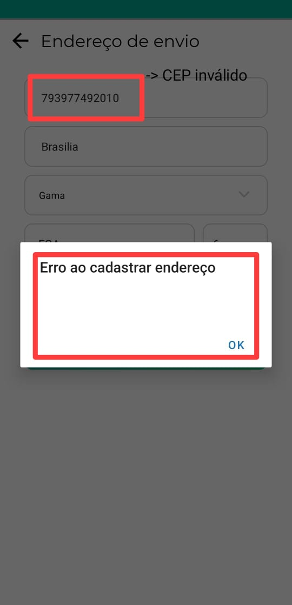

# Confiabilidade - M1: Percentual de erros com mensagem clara e sem perda de dados

## Introdução

Na presente execução da análise de confiabilidade do Agromart, foi definida, durante a [Fase 2](../../gqm/gqm.md#seleção-das-métricas) do projeto, métricas que seriam utilizadas para avaliação do software. Logo, este documento tem como objetivo sintetizar os achados da métrica M1 de confiabilidade do Agromart: Percentual de erros com mensagem clara e sem perda de dados.

## Referencial teórico 

Para executar a avaliação, os material utilizado para a medição foi a compreensão de erros definidas por Nielsen[1], para o entendimento de erros e como solucioná-los. Além disso, utilizou-se conhecimento adquirido sobre design de erros e como boas mensagens podem reduzir taxa de erros, aumentar produtividade e reforçar a confiança no produto[2].

## Análise 

Dessa forma, a avaliação será feita de forma manual, com a análise da aplicação [mobile](https://github.com/AgroMart/mobile-client) do Agromart, ao navegar pelo software e verificar possíveis erros. 

Cabe destacar que alguns erros não puderam ser testados, pois a aplicação apresentou falhas e inconsistências na conexão com a API. Como resultado, certos fluxos de navegação não estavam disponíveis na versão acessada e executada pelo grupo.

Os critérios de julgamento e níveis de pontuação da métrica serão utilizados conforme especificados na [Fase 2](../../gqm/gqm.md#níveis-de-pontuação-das-métricas).

### Execução da análise

Nas imagens de 1 a 10, estão documentados os erros encontrados e que serão analisados no AgroMart. Marcações em vermelho foram feitas par facilitar a identificação do erro que será verificado. 

A seguir, após as capturas de telas, a Tabela 1 documenta a análise dos erros identificados, com relação a clareza, perda de dados e solução para resolvê-lo. Nela também, encontra-se a pontuação de cada captura. 

<!-- Imagem 1: -->

Imagem 1 - Erro técnico ao iniciar a aplicação

  { style="display: block; margin: 0 auto;" width="400" }

Fonte: Captura de tela do mobile client do AgroMart

<!-- Imagem 2: -->

Imagem 2 - Erro exibir lojas na tela inicial

  { style="display: block; margin: 0 auto;" width="400" }

Fonte: Captura de tela do mobile client do AgroMart

<!-- Imagem 3: -->

Imagem 3 - Erro ao alterar dados cadastrais

  { style="display: block; margin: 0 auto;" width="400" }

Fonte: Captura de tela do mobile client do AgroMart

<!-- Imagem 4: -->

Imagem 4 - Erro ao alterar endereço, com CEP inválido

  { style="display: block; margin: 0 auto;" width="400" }

Fonte: Captura de tela do mobile client do AgroMart

<!-- Imagem 5: -->

Imagem 5 - Erro ao alterar endereço, com CEP válido

  { style="display: block; margin: 0 auto;" width="400" }

Fonte: Captura de tela do mobile client do AgroMart

<!-- Imagem 6: -->

Imagem 6 - Erro ao exibir planos

  { style="display: block; margin: 0 auto;" width="400" }

Fonte: Captura de tela do mobile client do AgroMart

<!-- Imagem 7: -->

Imagem 7 - Erro ao exibir histórico

  { style="display: block; margin: 0 auto;" width="400" }

Fonte: Captura de tela do mobile client do AgroMart

<!-- Imagem 8: -->

Imagem 8 - Informação, na tela de login, semelhante a erro ou log

  { style="display: block; margin: 0 auto;" width="400" }

Fonte: Captura de tela do mobile client do AgroMart

<!-- Imagem 9: -->

Imagem 9 - Erro ao logar 

  { style="display: block; margin: 0 auto;" width="400" }

Fonte: Captura de tela do mobile client do AgroMart

<!-- Imagem 10: -->

Imagem 10 - Erro ao realizar cadastro 

  { style="display: block; margin: 0 auto;" width="400" }

Fonte: Captura de tela do mobile client do AgroMart

Tabela 1 – Avaliação e pontuação dos erros avaliados no AgroMart

<table border="1">
  <thead>
    <tr>
      <th>Imagem (Erro)</th>
      <th>Possui clareza na exposição?</th> 
      <th>Possui persistência dos dados?</th>
      <th>Indica solução para resolver o erro?</th> 
      <th>Pontuação</th>
    </tr>
  </thead>
  <tbody>
    <tr>
      <td>1 - Erro técnico ao iniciar a aplicação</td>
      <td>Não</td>
      <td>Não</td>
      <td>Não</td>
      <td>0/3</td>
    </tr>
    <tr>
      <td>2 - Erro exibir lojas na tela inicial</td>
      <td>Não</td>
      <td>Sim</td>
      <td>Não</td>
      <td>1/3</td>
    </tr>
    <tr>
      <td>3 - Erro ao alterar dados cadastrais</td>
      <td>Não</td>
      <td>Não</td>
      <td>Não</td>
      <td>0/3</td>
    </tr>
    <tr>
      <td>4 - Erro ao alterar endereço, com CEP inválido</td>
      <td>Não</td>
      <td>Não</td>
      <td>Não</td>
      <td>0/3</td>
    </tr>
    <tr>
      <td>5 - Erro ao alterar endereço, com CEP válido</td>
      <td>Não</td>
      <td>Não</td>
      <td>Não</td>
      <td>0/3</td>
    </tr>
    <tr>
      <td>6 - Erro ao exibir planos</td>
      <td>Não</td>
      <td>Sim</td>
      <td>Não</td>
      <td>1/3</td>
    </tr>
    <tr>
      <td>7 - Erro ao exibir históricos</td>
      <td>Não</td>
      <td>Sim</td>
      <td>Não</td>
      <td>1/3</td>
    </tr>
    <tr>
      <td>8 - Informação, na tela de login, semelhante a erro ou log</td>
      <td>Não</td>
      <td>Sim</td>
      <td>Não</td>
      <td>1/3</td>
    </tr>
    <tr>
      <td>9 - Erro ao logar</td>
      <td>Não</td>
      <td>Não</td>
      <td>Não</td>
      <td>0/3</td>
    </tr>
    <tr>
      <td>10 - Erro ao realizar cadastro</td>
      <td>Não</td>
      <td>Não</td>
      <td>Não</td>
      <td>0/3</td>
    </tr>
  </tbody>
</table>

<b>Autor:</b> <a href="https://github.com/julia-fortunato">Júlia Fortunato</a>

## Resultados 

A análise evidenciou lacunas significativas na exibição de mensagens de erro no AgroMart. A Tabela 2 apresenta o percentual de conformidade obtido com base nas pontuações possíveis após a avaliação.

  
    
<b>Tabela 2 – Distribuição em percentual da análise de erros por pontuação</b>

  

  <table border="1" style="margin: 0 auto;">
    <thead>
      <tr>
        <th>Pontuação</th>
        <th>Quantidade</th>
        <th>Porcentagem</th>
      </tr>
    </thead>
    <tbody>
      <tr>
        <td>0/3</td>
        <td>6</td>
        <td>60,00%</td>
      </tr>
      <tr>
        <td>1/3</td>
        <td>4</td>
        <td>40,00%</td>
      </tr>
      <tr>
        <td>2/3</td>
        <td>0</td>
        <td>0,00%</td>
      </tr>
      <tr>
        <td>3/3</td>
        <td>0</td>
        <td>0,00%</td>
      </tr>
    </tbody>
  </table>

  
    
<b>Autor:</b> <a href="https://github.com/julia-fortunato" target="_blank">Júlia Fortunato</a>

  

Foi possível compreender que o nível de cobertura para a métrica é considerada **insatisfatória (pontuação 1)**, uma vez que 60% dos erros analisados não pontuaram em nenhum critério avaliado. 

Além disso, observou-se que não há mensagens claras sobre os erros, o que dificulta a compreensão por parte do usuário. As mensagens apresentadas não indicam de forma objetiva o que causou o erro, tampouco fornecem orientações sobre como corrigi-lo ou prosseguir. Essa ausência de feedback informativo compromete diretamente a experiência do usuário e dificulta a identificação de falhas por parte da equipe técnica.

No entanto, um ponto que contribuiu positivamente para a avaliação foi o fato de que, em grande parte dos casos, os dados inseridos pelo usuário são preservados mesmo quando o erro ocorre, evitando perda de informação e reduzindo a frustração em recomeçar tarefas do zero. Ainda assim, isso indica que é necessário revisão e correção do tratamento de erros do AgroMart.

## Referências Bibliográficas

> [1] NIELSEN, Jakob. Mobile Usability. Berkeley: New Riders Pub, 2012.

> [2] GASSENFERTH, Daniel. How to design better error messages • Centigrade GmbH. Disponível em: <https://www.centigrade.de/en/blog/how-to-design-better-error-messages/>. Acesso em: 07 de julho de 2025.

## Histórico de Versões

|Versão|Data|Descrição|Autor|Revisor|
|:----:|----|---------|-----|:-------:|
|`1.0`|07/07/2025|Criação do documento| [Júlia Fortunato](https://github.com/julia-fortunato) |[Weverton Rodrigues](https://github.com/vevetin)|
|`1.1`|08/07/2025|Ajuste imagem| [Maria Clara](https://github.com/Oleari19) | - |